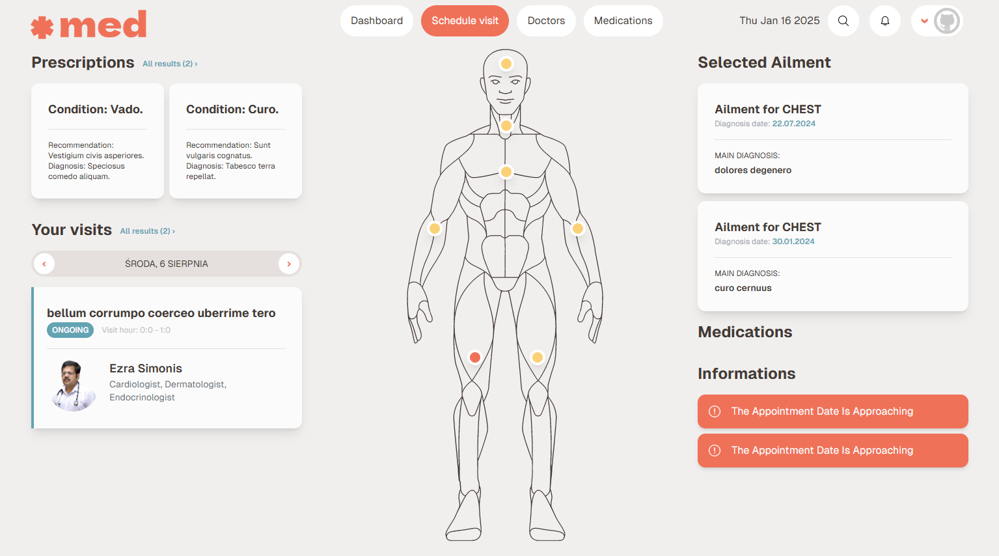
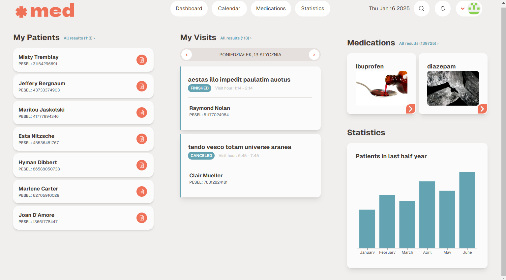

# Medical Clinic Management System
A comprehensive software solution for medical clinics, providing efficient patient management, appointment scheduling, medical record keeping, and administrative operations.
## Techstack

## Patient's View

## Doctor's View

## Overview
This application is designed to streamline operations in medical clinics by digitizing processes such as patient registration, appointment scheduling, medical record management, and administrative tasks. The system provides tailored interfaces for different users including patients, doctors, receptionists, accounting staff, and administrators.
## Architecture
The application is built as a monolithic web application using the T3 Stack, allowing for easy implementation, deployment, and maintenance. Each clinic operates as a separate tenant with dedicated application instances and databases.

## License
[MIT](https://choosealicense.com/licenses/mit/)
